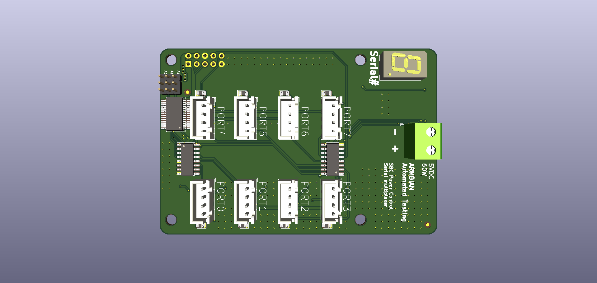
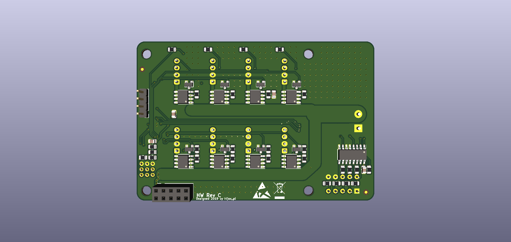

# MPADS Production files

While placing order at JLCPCB use following files:
- gerbers.zip
- jlcpcb-bom.cvs as bill of material file
- jlcpcb-cpl.csv as component placing file

Use only "top" layer, i.e. the one with mosfets and passive components

Preview with proper component packages placement:

[Take a look at the interactive BOM here](https://htmlpreview.github.io/?https://github.com/armbian/mpads/blob/master/serial-mux/assembly/ibom.html)
